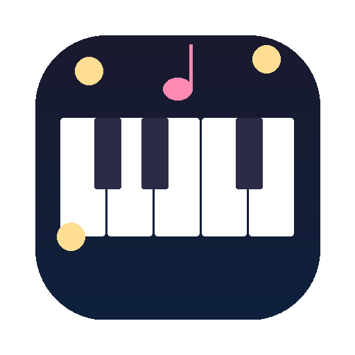

# 🎹 オノマトペキーボード

> 打つたび、ちいさく鳴る。  
> ぽ。ふわ。えへ。  
> 少しだけ、タイピングが楽しくなる。

[English README is here](README_EN.md)

打つたび、日本語のオノマトペや短い声が鳴るデスクトップアプリです。  
「ぽ。」「ふわ。」「えへ。」みたいな音で、タイピングを少しだけ楽しくします。

Electron + uiohook-napi + Web Audio API で構築。  
macOS優先、将来的なWindows対応も考慮した構成です。



## 主な機能

- グローバルキーボード入力検知
- キー種別ごとの音再生
- 4つのサウンドモード
  - 🌸 おとなしい
  - 🎉 たのしい
  - 🐱 えへ系
  - 🌀 カオス
- 音量調整
- ON / OFF 切替
- 連打時の音間引き
- ナイトモード
- 設定の永続化
- テスト再生機能

## モード紹介

### 🌸 おとなしい
普段使い向け。短く静かな音が中心です。  
例: `ぽ`, `ぴ`, `こ`, `ふわ`, `すっ`

### 🎉 たのしい
遊びと実用の中間。ちょっと気分が上がります。  
例: `ぽぽ`, `きゅ`, `ぴこ`, `ぽわーん`, `ぴんぽーん！`

### 🐱 えへ系
声っぽさ強め。かわいいけど人を選びます。  
例: `えへ`, `にゃ`, `ふふ`, `やったー！`, `あれ〜`

### 🌀 カオス
ネタ用。配信向け。普段使いは自己責任。  
例: `ぐわ`, `びよーん`, `どーん！`, `じゃーん！`

## 動作環境

- macOS / Windows
- Node.js 18以上 / npm

## 起動方法

```bash
git clone https://github.com/soramusubi-ctrl/onomatope-keyboard.git
cd onomatope-keyboard
npm install
npm start
```

### macOSでの注意

グローバルキーボード検知のため、初回起動時に以下の許可が必要です。

1. システム設定 > プライバシーとセキュリティ > アクセシビリティ
2. アプリにチェックを入れてください。

## 技術スタック

- Electron v28
- uiohook-napi
- Web Audio API
- electron-store

## ディレクトリ構成

```
onomatope-keyboard/
├── src/
│   ├── main.js
│   ├── preload.js
│   └── renderer/
│       ├── index.html
│       ├── styles.css
│       ├── soundEngine.js
│       └── app.js
├── assets/
│   ├── sounds/
│   └── icon.png
├── build/
├── generate_sounds.py
└── package.json
```

## 今後の予定

- 対象アプリ指定
- 自作ボイス追加
- 音声バリエーション追加
- 軽量化
- 配布版の整備

## なぜ作ったか

キーボード音アプリはあるけれど、
「日本語のオノマトペ」や「ちょっとした声」が鳴るものが欲しくて作りました。

全部のキーをうるさくするのではなく、
少し笑えて、ギリ普段使いできるバランスを狙っています。

## License

MIT
